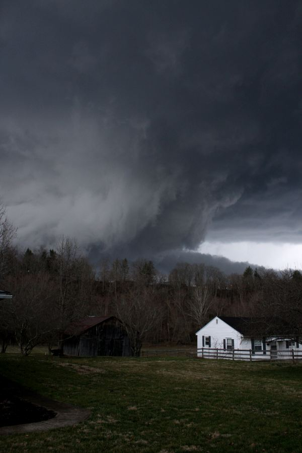

# <b>Tornado Damage and Casualties<b>
### By Timothy Holbrook

 
Tornado damage since 1950 has been significant, with numerous destructive tornadoes causing 
extensive damage to property and infrastructure, as well as resulting in casualties and injuries.

