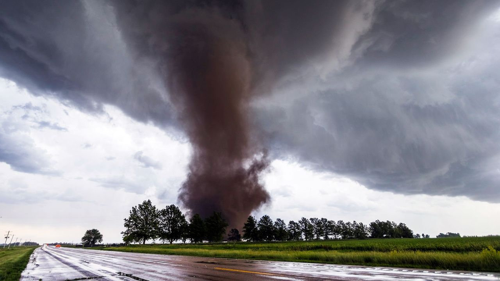
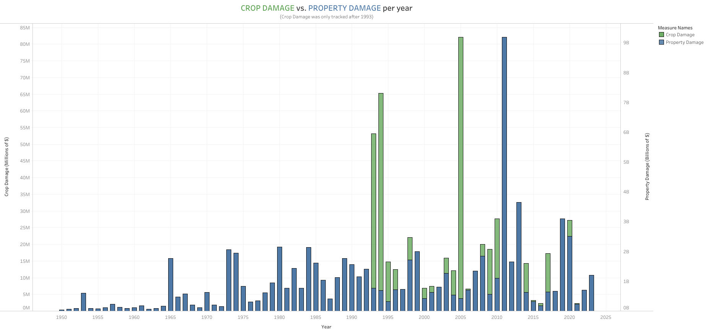

# Tornado Damage and Casualties

Tornado damage since 1950 has been significant, with numerous destructive tornadoes causing 
extensive damage to crops and infrastructure as well as resulting in many casualties and injuries.

## Objective

The objective of this project is to analyze and present data on tornado occurrences in the United
States since 1950, showing the extent of damage inflicted on both crops and infrastructure.
Additionally, the project aims to present the number of injuries and fatalities resulting from
these disasters.

Questions:

- What is the impact of crop damage compared to property damage caused by tornadoes in the United 
  States? 
- How many injuries and fatalities do tornadoes typically inflict upon the United States annually?

## Project Requirements
  
1. Read TWO data files (JSON, CSV, Excel, etc.):
   - 1950-23 damage_fatal_injury.csv
   - 1950-2023_tor_fatalities.csv

2. Clean your data and perform a pandas merge with your two data sets, then calculate some new
   values based on the new data set.
     - Data was cleaned in clean.ipynb
     - Pandas merge was performed in Main.ipynb

3. Make a Tableau dashboard to display your data.

   
   Tableau dashboard can be viewed [here](https://public.tableau.com/app/profile/timothy.holbrook/vizzes).

4. Utilize a virtual environment and include instructions in your README on how the user should set
   one up.

5. Annotate your code with markdown cells in Jupyter Notebook, write clear code comments, and have a
   well-written README.md

## Running the Project

1. Python 3 is required. Project was created with version 3.11.7. Python can be downloaded [here](https://www.python.org/downloads/).
2. Clone the repo from GitHub.
   - You can create a GitHub account [here](https://github.com/) if needed.
   - To learn how to clone a repo on GitHub, please click [here](https://docs.github.com/en/repositories/creating-and-managing-repositories/cloning-a-repository).
3. Setup virtual environment. Please run the following into terminal of your choice inside main folder once cloned.
   - On macOS/Linux: python3 -m venv venv
   - On Windows: python -m venv venv
4. Activate virtual environment
   - on macOS/Linux: source venv/bin/activate
   - on Windows: venv/Scripts/activate
5. Install requirements: run "pip install -r requirements.txt"
6. After installation completes, you can verify what was installed with: run "pip list"
7. You can run the "clean.ipynb" and "Main.ipynb" files in Jupyter Notebook. For more info on Jupyter Notebook please click [here](https://www.jupyter.org/).
8. "clean.py" and "Main.py can be ran in Visual Studio Code.
   - Open Visual Studio Code and navigate to project folder.
   - Open "clean.py" or "Main.py" 
   - Right click on "clean.py" and "Main.py" and click Run Current File in Interactive Window.

   ## Conclusion

    Crop and Property Damage

   As illustrated in the image below, you can see the extent of property damage is significantly higher than that of crop damage. Tornadoes unleash strong winds and flying debris, which can damage homes, businesses, and other structures. Agricultural crops can also experience major damage, but this seems to be more localized depending on factors such as the tornado's path and crop type. From the data analyzed, the average property damage a year from 1950 to 2023 is $970,478,139.05. The average crop damage a year from those same years is $15,799,214.38.

   
   [Interactive Visualization](https://public.tableau.com/app/profile/timothy.holbrook/viz/CropDamagevs_PropertyDamagewithAnnualTornadoCount/Sheet22)

   
   Injuries and Fatalities

   Advances in technology and communication have allowed timely alerts and increased
   preparedness. People are given advance notices to have an opportunity to seek shelter
   faster. Prompt emergency response has also contributed to the lower numbers over the years.
   As illustrated below, you can see the comparison of injuries and fatalities pulled from the
   data analyzed. The average injuries a year from 1950 to 2023 is 1330. The average fatalities a year from 1950 to 2023 is 84. 

   
   [Interactive Visualization](https://public.tableau.com/app/profile/timothy.holbrook/viz/TornadoFatalitiesvsInjuriesBarLine/Sheet2)

   

